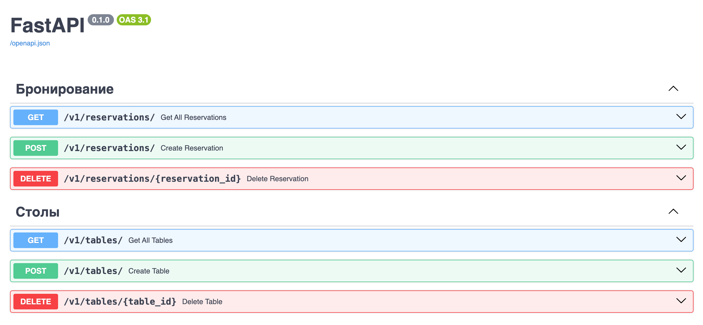

# restaurant_reservations

#### Стек: Python, FastAPI, uvicorn, SQLModel, postgresql, asyncpg, alembic, pytest

## О проекте
Этот проект представляет собой веб-приложение(backend) для бронирования столиков в ресторане.
Сервис позволяет создавать, просматривать и удалять брони, а также управлять столиками и временными слотами.


## Запуск проекта

Для запуска проекта необходимо: 
* Установите Docker согласно инструкции с официального сайта: https://docs.docker.com/
* Клонировать репозиторий
```
git clone git@github.com:pashpiter/restaurant_reservations.git
```
* Перейти в папку restaurant_reservations
```
cd restaurant_reservations
```
* В папке создайте файл `.env` с переменных окружения
```
touch .env
```
* Заполните по примеру своими значениями как в этом [файле](example.env)
* Для запуска проекта введите команду:
```
docker compose up -d
```
или если локально установлен Make:
```
make up
```
> **Тесты.** Проект покрыт тестами, которые выполняются при сборке контейнеров.


## Документация
После запуска документация доступна по адресу:
```
127.0.0.1:8000/docs
```

## Энодпоинты API


#### Pavel Drovnin [@pashpiter](http://t.me/pashpiter)